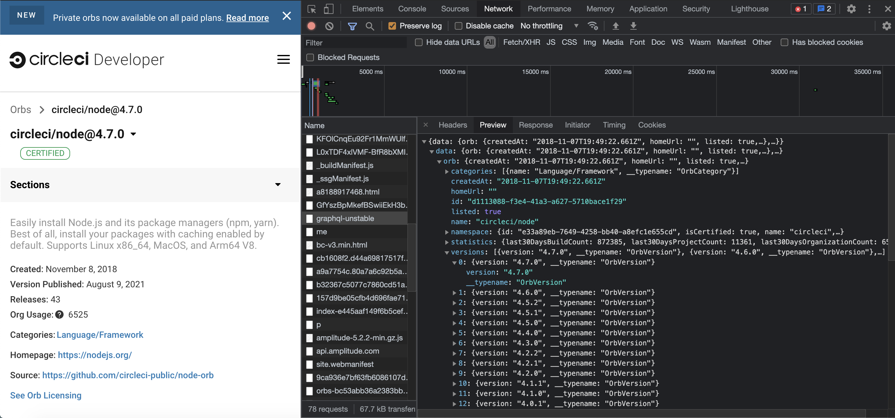

# CircleCI Orb Version Check

This is an unofficial tool (Docker image) that checks your CircleCI config for outdated Orbs used.


It simply returns 0 if all declared Orbs are of the latest available version, or a non-zero N where N is the number of orbs that can be upgraded.

## Usage Examples

### Local (with Docker)

```sh
docker pull kelvintaywl/circleci-orb-version-check

cd /path/to/your/project
docker run -v $PWD/.circleci/:/home/circleci/project/.circleci/ kelvintaywl/circleci-orb-version-check
```

### CircleCI

```yml
version: 2.1

jobs:
  check_orbs:
    docker:
      - image: kelvintaywl/circleci-orb-version-check
    environment:
      CIRCLE_WORKING_DIRECTORY: /home/circleci/project
    steps:
      - checkout
      - run:
          command: |
            /tmp/orb-version-check.sh

workflows:
  my_workflow:
    jobs:
      - check_orbs
```

## Explain

The main "magic" of this script is to lookup the current latest versions of the imported CircleCI orbs.


I did not find any mention about retrieving this information via the [CircleCI API documentation](https://circleci.com/docs/api/v2/).


Through reverse engineering, I found out that the [CircleCI orb registry page](https://circleci.com/developer/orbs) uses GraphQL to lookup and populate the orb detail page.
This lookup includes the different versions available.




Hence, this script fires HTTP requests to the GraphQL endpoint at https://circleci.com/graphql-unstable , and the request payload (JSON) is modified accordingly with `jq`.

See the [payload file](curl_payload.json) for the request payload.
